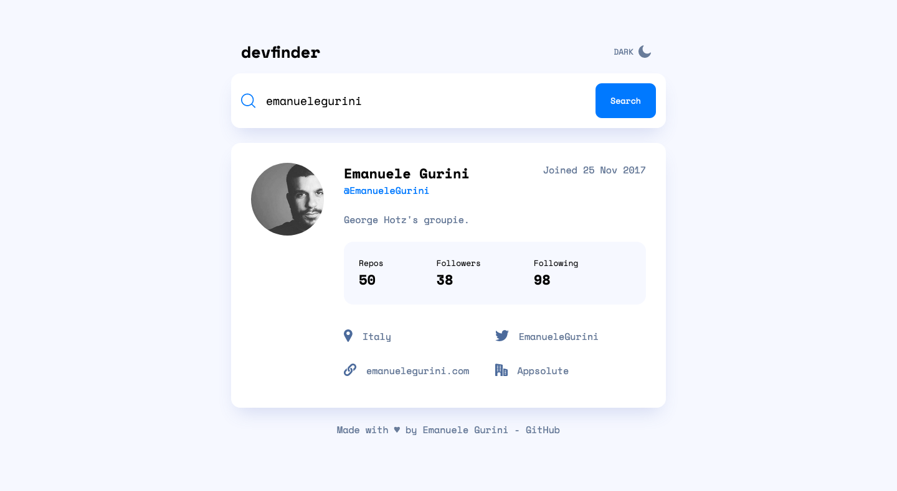
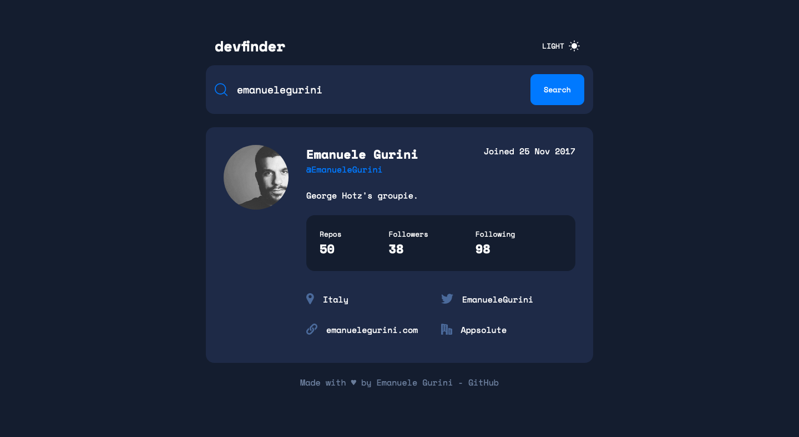
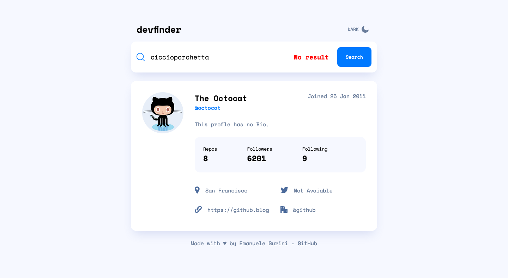

# Frontend Mentor - GitHub user search app solution

This is a solution to the [GitHub user search app challenge on Frontend Mentor](https://www.frontendmentor.io/challenges/github-user-search-app-Q09YOgaH6). Frontend Mentor challenges help you improve your coding skills by building realistic projects.

## Table of contents

- [Overview](#overview)
  - [The challenge](#the-challenge)
  - [Screenshot](#screenshot)
  - [Links](#links)
- [My process](#my-process)
  - [Built with](#built-with)
- [Author](#author)

## Overview

### The challenge

Users should be able to:

- View the optimal layout for the app depending on their device's screen size
- See hover states for all interactive elements on the page
- Search for GitHub users by their username
- See relevant user information based on their search
- Switch between light and dark themes
- TODO: **Bonus**: Have the correct color scheme chosen for them based on their computer preferences. _Hint_: Research `prefers-color-scheme` in CSS.

### Screenshot

### Links

- Solution URL: [Repository](https://github.com/EmanueleGurini/react-githubsearch)
- Live Site URL: [Deploy](https://react-githubsearch-f63e3.web.app/)

### Built with

- React.js
- TypeScript
- CSS Module
- Context
- API

## Author

- Website - [Emanuele Gurini](https://www.emanuelegurini.com)
- Frontend Mentor - [@EmanueleGurini](https://www.frontendmentor.io/profile/EmanueleGurini)
- Twitter - [@EmanueleGurini](https://www.twitter.com/EmanueleGurini)
